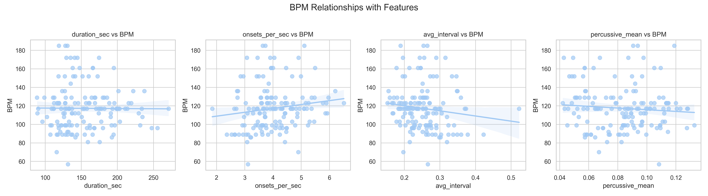

# BPM Prediction from Audio

This project explores how machine learning can be used to estimate the tempo (BPM) of music tracks from raw audio signals.

The idea is to extract rhythm-related features from audio files and train a regression model that predicts BPM values.  
This project was mainly built to experiment with audio feature extraction and machine learning workflows.

## Project Goal

Music tempo is often represented as **BPM (beats per minute)**.  
Instead of using rule-based tempo detection only, this project attempts to predict BPM using machine learning.

The pipeline includes:

- audio preprocessing
- rhythm feature extraction
- dataset generation
- training a regression model

## Dataset

The dataset is built from raw audio files.

For each audio file:

- rhythm-related features are extracted
- BPM labels are obtained from analysis tools or metadata
- the features are used to train a regression model

## Feature Extraction

Audio features are extracted using **Librosa**.

Examples of features used:

- onset strength
- tempo estimation
- spectral features
- rhythmic components
- beat-related statistics

These features help represent the rhythmic structure of the audio.

## Model

The regression model used in this project:

- **Random Forest Regressor**

Reasons for using Random Forest:

- handles nonlinear relationships well
- robust to noisy data
- works well with tabular features

## Evaluation

Model performance is evaluated using:

- Mean Absolute Error (MAE)
- R² score

These metrics help measure how accurately the model predicts BPM values.

## Project Workflow

1. Load audio files
2. Extract rhythm features using Librosa
3. Build a feature dataset
4. Train the machine learning model
5. Evaluate prediction performance

## Requirements

Main libraries used in this project:
numpy
pandas
librosa
scikit-learn

## Possible Improvements

This project can be extended in several ways:

- try deep learning models for tempo prediction
- include more audio features
- increase dataset size
- test performance on different music genres

## Author

Passawee Kaewduk  
Computer Engineering, Rangsit University  

GitHub: https://github.com/murakami1346
